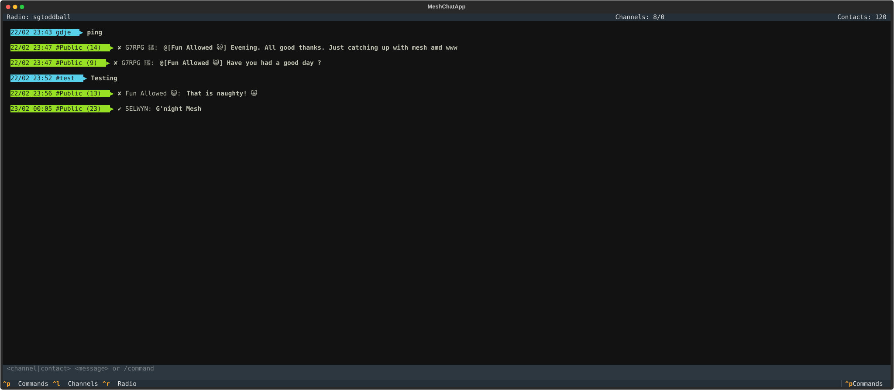

# MeshChaTUI
MeshChaTUI is a Textual TUI wrapper over [Meshcore_py](https://github.com/meshcore-dev/meshcore_py). The aims were to provide a terminal application to interact with Meshcore companion radios. I wanted a unified message window, where all messages were displayed from all subscribed channels and direct messages from contacts in chronological order.

This is a personal project created as a learning experience, and for my specific requirements. I do not have access to a lot of devices or other machines. Testing has been limited to what i have on hand. Several Heltec v3 boards and has only been run on a linux machine. I dont see any reason why it wouldnt run on Windows or MAC os (as it is entirely python), but there are no guarentees that this will work. 

## Screenshot


## Installation

1.  **Clone the repository:**
    ```bash
    git clone <repository-url>
    cd MeshChaTUI
    ```

2.  **Create a virtual environment (recommended):**
    ```bash
    python -m venv .venv
    source .venv/bin/activate
    ```

3.  **Install the dependencies:**
    ```bash
    pip install -r requirements.txt
    ```


## Usage

1.  **Run the application:**
    ```bash
    python run.py [--debug]
    ```
    *   To enable debug mode, run with the `--debug` flag: `python run.py --debug`.
        In debug mode, detailed debug logs will be written to `app_error.log`, and all
        subscribed radio messages will be logged in JSON format to a file named
        `radio_messages.json` in the project root directory.

2.  **Connect to your radio:**
     * Choose between Serial or Bluetooth connection tabs.
     * For Serial: Enter the device name, port (e.g., `/dev/ttyUSB0`), and baud rate (default `115200`).
     * For Bluetooth: Scan for and select your device from the list.

3.  **Interface Overview:**
    *   **Header Bar**: Displays the connected radio name and counts for subscribed channels and contacts.
        *   Click the **Radio Name** or type `/radio` to view detailed radio information and statistics.
        *   Click the **Channels Count** or type `/channels` to see an overlay of subscribed channels.
        *   Click the **Contacts Count** or type `/contacts` to see an overlay of known contacts. Select a contact from the list to view its details.
    *   **Command Palette**: Press `ctrl+p` or `f1` to open the command palette and search for available actions.
    *   **Footer**: Shows quick key bindings for common actions.

4.  **Send a message or run a command:**
    Type into the bottom input bar using one of these formats:
    *   **Send to Channel**: `<channel_name> <message>` (e.g., `#general Hello everyone!`)
    *   **Send Direct Message**: `<contact_name> <message>` (e.g., `Alice Hi there!`)
    *   **Run a Command**: `/command [args]` (e.g., `/join #meshchat`)

### Available Commands

All commands are prefixed with a forward slash `/`:
*   `/channels`: Show subscribed channels overlay.
*   `/contacts`: Show known contacts overlay.
*   `/radio`: Show detailed radio info and statistics.
*   `/join <#channel>`: Join a public hashtag channel.
*   `/add`: Open the screen to add a new contact (from recent adverts or manually).
*   `/remove <name>`: Remove a contact by their name.
*   `/purge <client|repeater|room>`: Remove all contacts of a specific type.
*   `/advert`: Send a flood advertisement from your radio.
*   `/disconnect`: Disconnect from the radio and return to the connection screen.

### Message Delivery Confirmation

Messages sent via the TUI are only added to the chat window once their delivery is confirmed by the radio:
- **Direct Messages**: Displayed after an `ACK` is received from the destination (includes automatic retries and fallback to flood routing).
- **Channel Messages**: Displayed once the radio confirms the command has been broadcast (`OK` status).
- **Notifications**: Temporary toast notifications will indicate the "Sending..." status while confirmation is pending.

